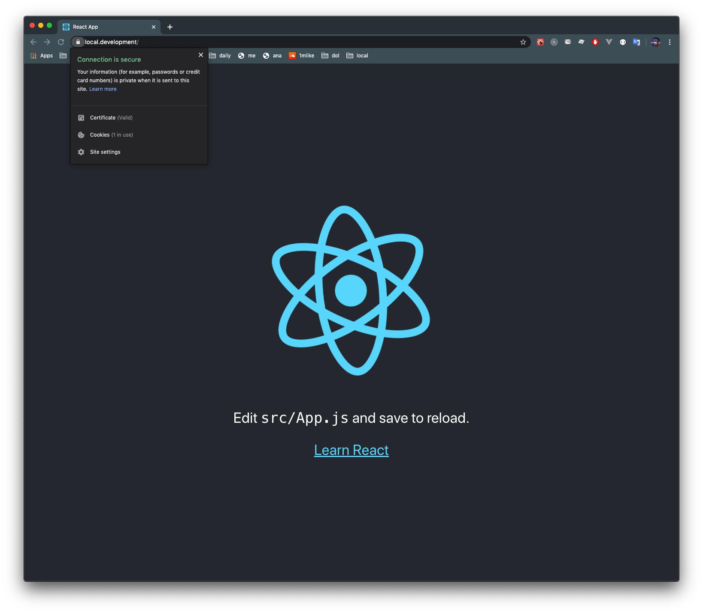

Every time we start a project with the following URL: **http://localhost:PORT**, right? Have you ever thought about another way to access local development URL, like 
**https://project-local.com** or **https://cool-project.dev**. If this is your problem, I'll show 
you a solution: **[dev-nginx](https://github.com/guardian/dev-nginx)**

Install instructions and commands are explained in very detail in **[its repo page](https://github.com/guardian/dev-nginx)**. In this post, I'll show you how to setup

#### Step 1: Config file
You can save the config file anywhere, but save inside the project root folder is da-best,
other developers can use your config file.

```yml
#nginx.yml
name: my-cool-project # This name will be created as nginx config file in /usr/local/etc/nginx/servers
domain-root: local.development # Domain name you want
mappings:
  - port: 3009 # port your project listening
    prefix: # Leave it blank. If you provide something. Ex: project. Then you should access it via project. local.development
# If you leave this config file like this
# You will forward http://localhost:3990 to https://local.development
```

#### Step 2: Add domain to file host
Run this command: **dev-nginx add-to-hosts-file your-domain**

```bash
dev-nginx add-to-hosts-file local.development
```

After that, your *host* file will be like this

```
##
# Host Database
#
# localhost is used to configure the loopback interface
# when the system is booting. Do not change this entry.
##
127.0.0.1	localhost
255.255.255.255	broadcasthost
::1             localhost
127.0.0.1		local.development
```

#### Step final: Tell dev-nginx run and parse config file

```bash
dev-nginx setup-app nginx.xml
```

After this command, **dev-nginx** will create config file inside **/usr/local/etc/nginx/servers** folder

```bash
# my-cool-project
server {
  listen 443 ssl;
  server_name local.development;

  location / {
    proxy_pass http://localhost:3000;
    proxy_set_header X-Real-IP $remote_addr;
    proxy_set_header X-Forwarded-For $proxy_add_x_forwarded_for;
    proxy_set_header Host $http_host;
    proxy_redirect default;
    proxy_buffering off;
  }

  ssl_certificate     local.development.crt;
  ssl_certificate_key local.development.key;

  ssl_session_timeout 5m;

  ssl_protocols TLSv1 TLSv1.1 TLSv1.2;
  ssl_ciphers HIGH:!aNULL:!MD5;
  ssl_prefer_server_ciphers on;
}

server {
  listen 80;
  server_name local.development;

  # redirect all HTTP traffic to HTTPS
  return 301 https://$host$request_uri;
}


```

That's it! Now you can access **https://local.development** in your browser



Happy coding :) !!!
